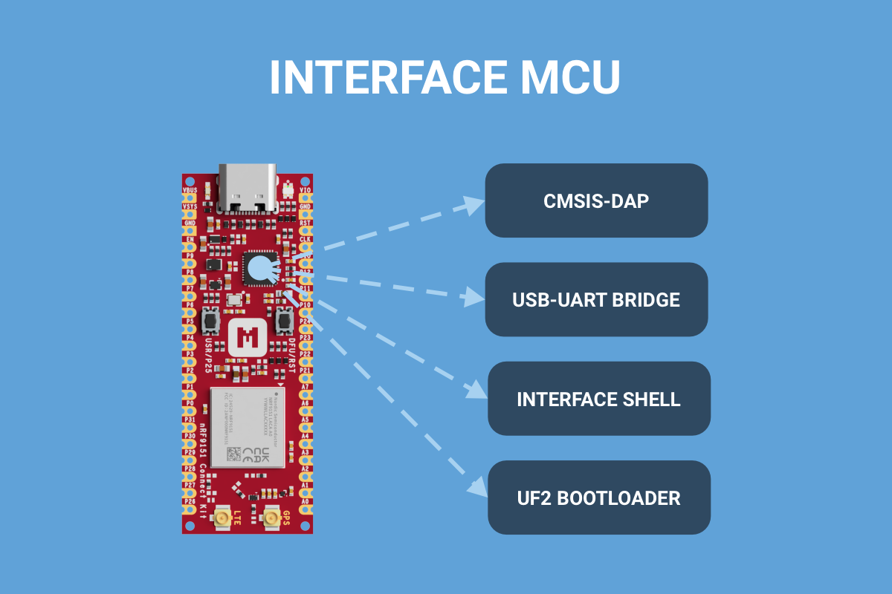
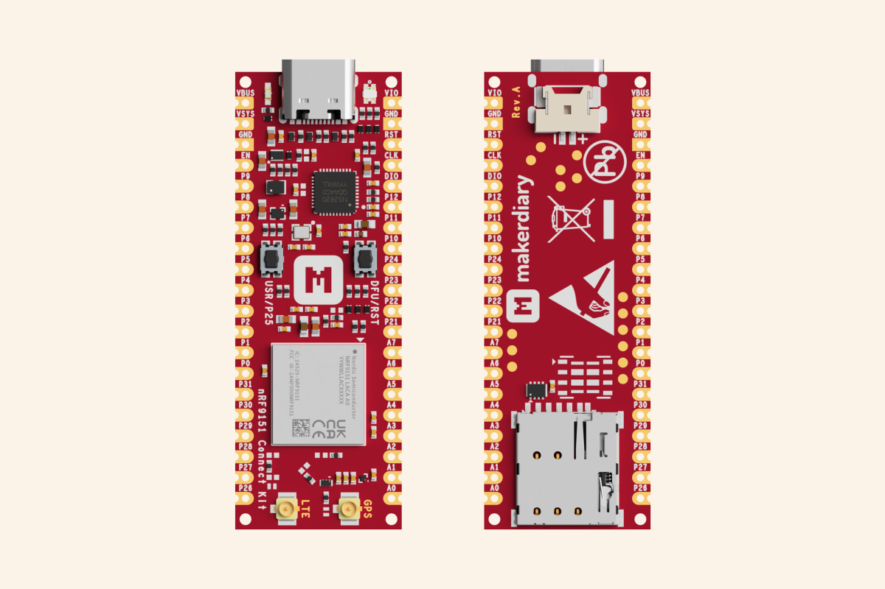

# What's New

-   [][introducing-nrf-cloud]

    __[Introducing nRF Cloud][introducing-nrf-cloud]__

    nRF Cloud offers a suite of services optimized for Nordic ultra-low power wireless devices that supports your IoT deployment throughout its entire lifecycle.

    :octicons-calendar-24: Mar 11, 2025 ・ :octicons-clock-24: 4 min read

    [introducing-nrf-cloud]: ./updates/posts/introducing-nrf-cloud/index.md

-   [][introducing-interface-mcu]

    __[Introducing Interface MCU][introducing-interface-mcu]__

    The Interface MCU simplifies debugging and programming of the nRF9151 SiP without external tools and provides access to board-specific features.

    :octicons-calendar-24: Mar 10, 2025 ・ :octicons-clock-24: 3 min read

    [introducing-interface-mcu]: ./updates/posts/introducing-interface-mcu/index.md

-   [][nrf9151-connect-kit-is-here]

    __[nRF9151 Connect Kit is Here!][nrf9151-connect-kit-is-here]__

    Today we are excited to launch our latest IoT prototyping kit, the nRF9151 Connect Kit, for LTE-M, NB-IoT, DECT NR+, and GNSS applications.

    :octicons-calendar-24: Mar 07, 2025 ・ :octicons-clock-24: 4 min read

    [nrf9151-connect-kit-is-here]: ./updates/posts/nrf9151-connect-kit-is-here/index.md

[View all](./updates/index.md){ .md-button .md-button--primary }

