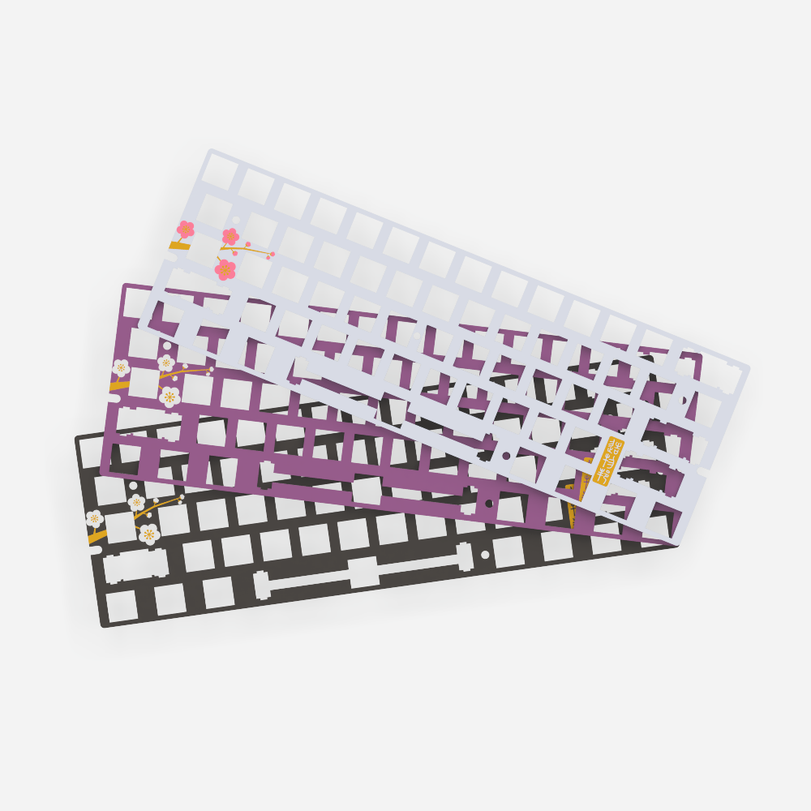
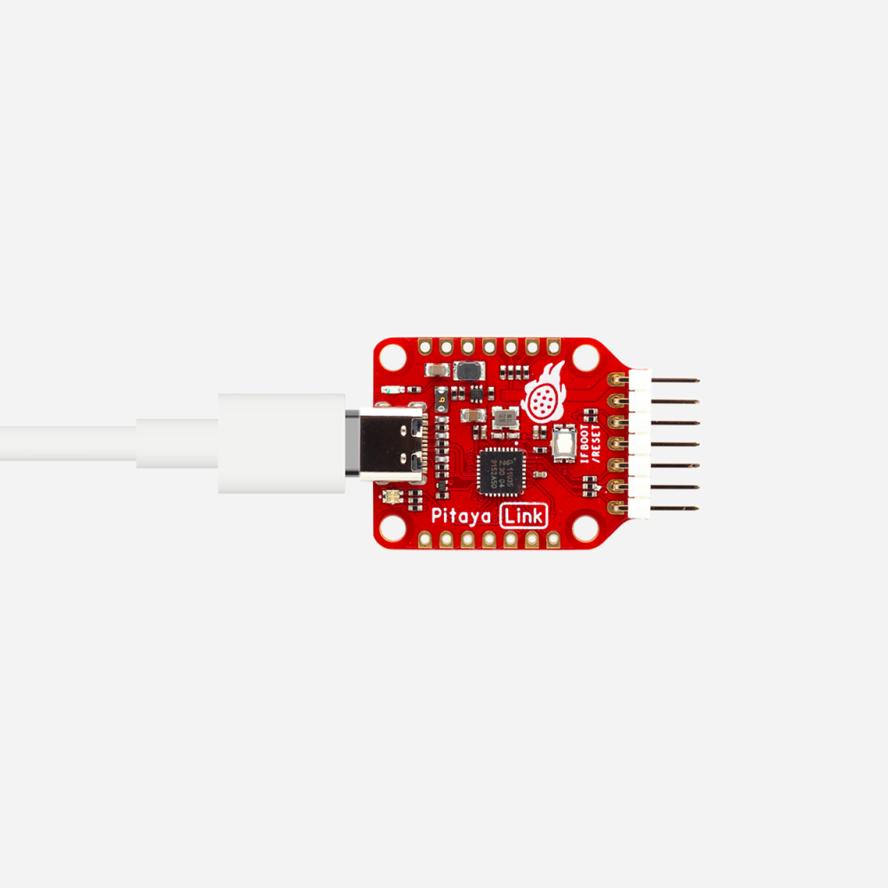
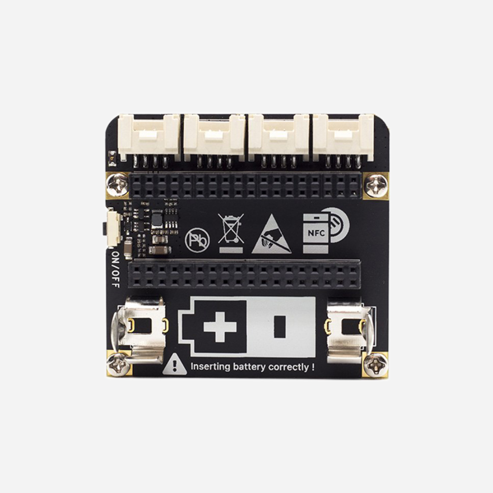

# Accessories

> Essential add-ons for open-source hardware, from sensors to expansion boards, to power your projects and fuel innovation.

-   [][m60plate-product]

    [M60 Mechanical Keyboard Plate][m60plate-product]

    [Buy now][m60plate-product]{ .md-button .md-button--primary }

    [Documentation][m60plate-docs]{ .md-button }

    [m60plate-product]: https://makerdiary.com/products/m60-mechanical-keyboard-plate
    [m60plate-docs]: https://wiki.makerdiary.com/m60

-   [][pitayalink-product]

    [Pitaya-Link CMSIS-DAP Debug Probe][pitayalink-product]

    [Buy now][pitayalink-product]{ .md-button .md-button--primary }

    [Documentation][pitayalink-docs]{ .md-button }

    [pitayalink-product]: https://makerdiary.com/products/pitaya-link
    [pitayalink-docs]: https://wiki.makerdiary.com/pitaya-link

-   [][base-dock-product]

    [Base Dock (Grove Compatible)][base-dock-product]

    [Buy now][base-dock-product]{ .md-button .md-button--primary }

    [Documentation][base-dock-docs]{ .md-button }

    [base-dock-product]: https://makerdiary.com/products/base-dock
    [base-dock-docs]: https://wiki.makerdiary.com/base-dock

