# Prototyping Kits

> Our prototyping kits make it easy to take your idea from sketch into proof-of-concept.

-   [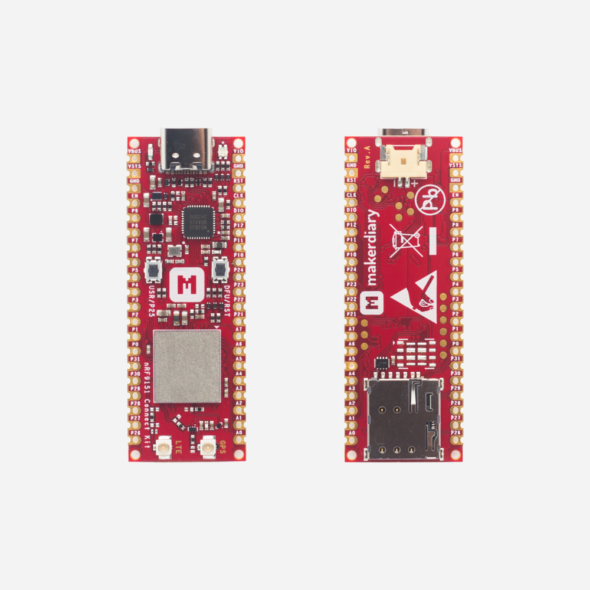][nrf9151-connectkit-product]

    [nRF9151 Connect Kit][nrf9151-connectkit-product]

    [Buy now][nrf9151-connectkit-product]{ .md-button .md-button--primary }

    [Documentation][nrf9151-connectkit-docs]{ .md-button }

    [nrf9151-connectkit-product]: https://makerdiary.com/products/nrf9151-connectkit
    [nrf9151-connectkit-docs]: https://wiki.makerdiary.com/nrf9151-connectkit

-   [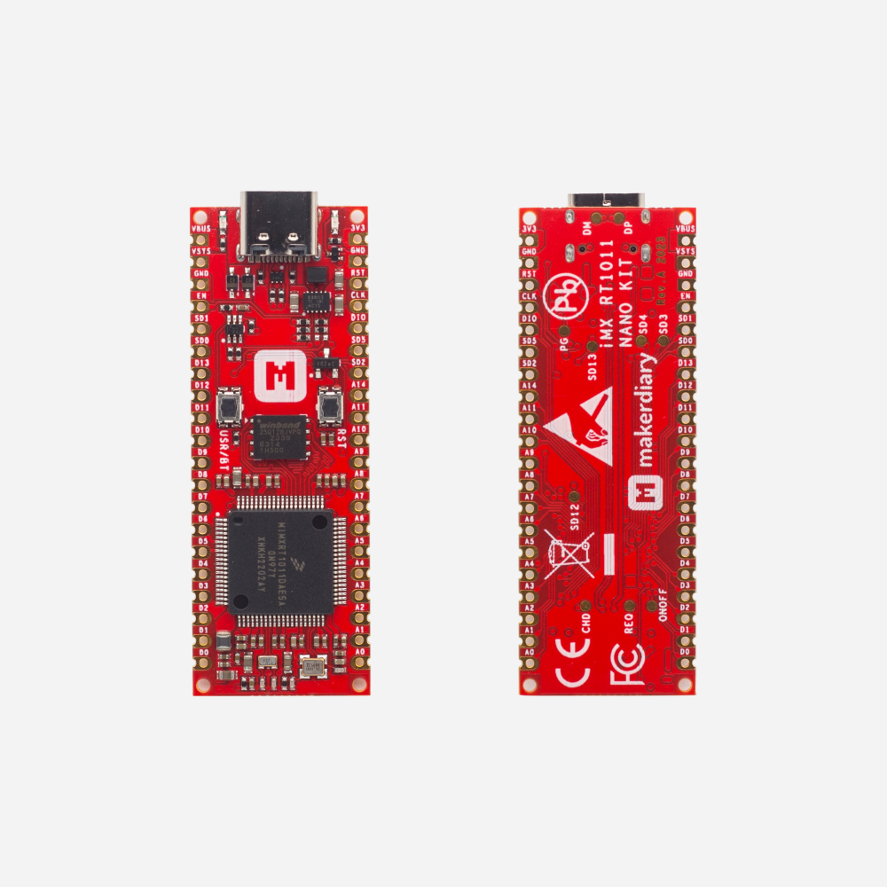][imxrt1011-nanokit-product]

    [iMX RT1011 Nano Kit][imxrt1011-nanokit-product]

    [Buy now][imxrt1011-nanokit-product]{ .md-button .md-button--primary }

    [Documentation][imxrt1011-nanokit-docs]{ .md-button }

    [imxrt1011-nanokit-product]: https://makerdiary.com/products/imxrt1011-nanokit
    [imxrt1011-nanokit-docs]: https://wiki.makerdiary.com/imxrt1011-nanokit

-   [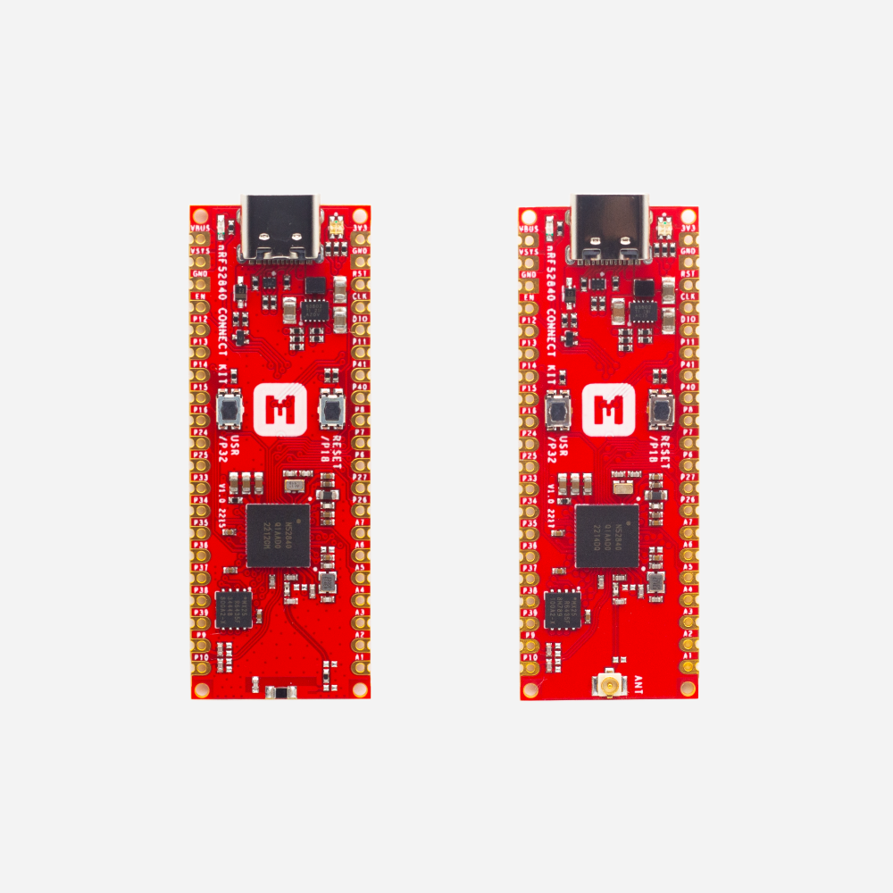][nrf52840-connectkit-product]

    [nRF52840 Connect Kit][nrf52840-connectkit-product]

    [Buy now][nrf52840-connectkit-product]{ .md-button .md-button--primary }

    [Documentation][nrf52840-connectkit-docs]{ .md-button }

    [nrf52840-connectkit-product]: https://makerdiary.com/products/nrf52840-connectkit
    [nrf52840-connectkit-docs]: https://wiki.makerdiary.com/nrf52840-connectkit

-   [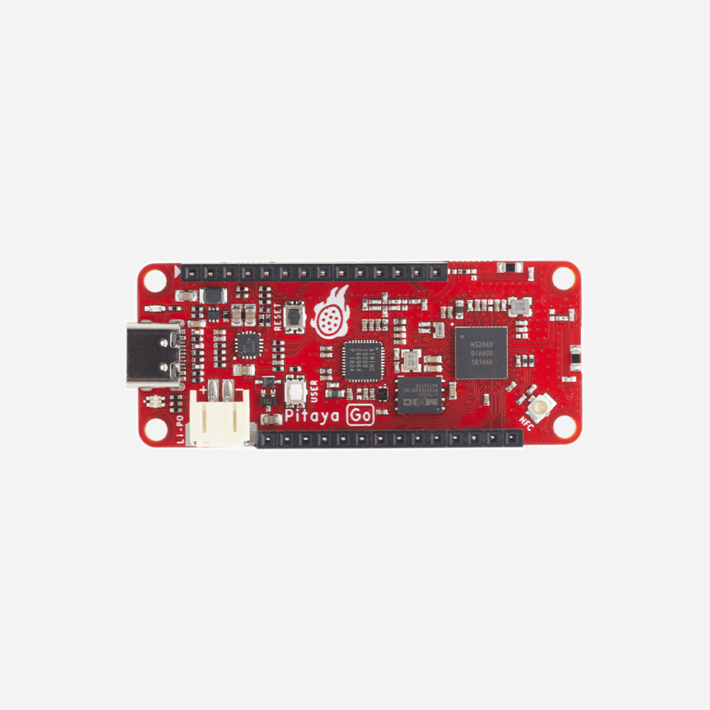][pitaya-go-product]

    [Pitaya Go nRF52840 WiFi IoT Board][pitaya-go-product]

    [Buy now][pitaya-go-product]{ .md-button .md-button--primary }

    [Documentation][pitaya-go-docs]{ .md-button }

    [pitaya-go-product]: https://makerdiary.com/products/pitaya-go
    [pitaya-go-docs]: https://wiki.makerdiary.com/pitaya-go

-   [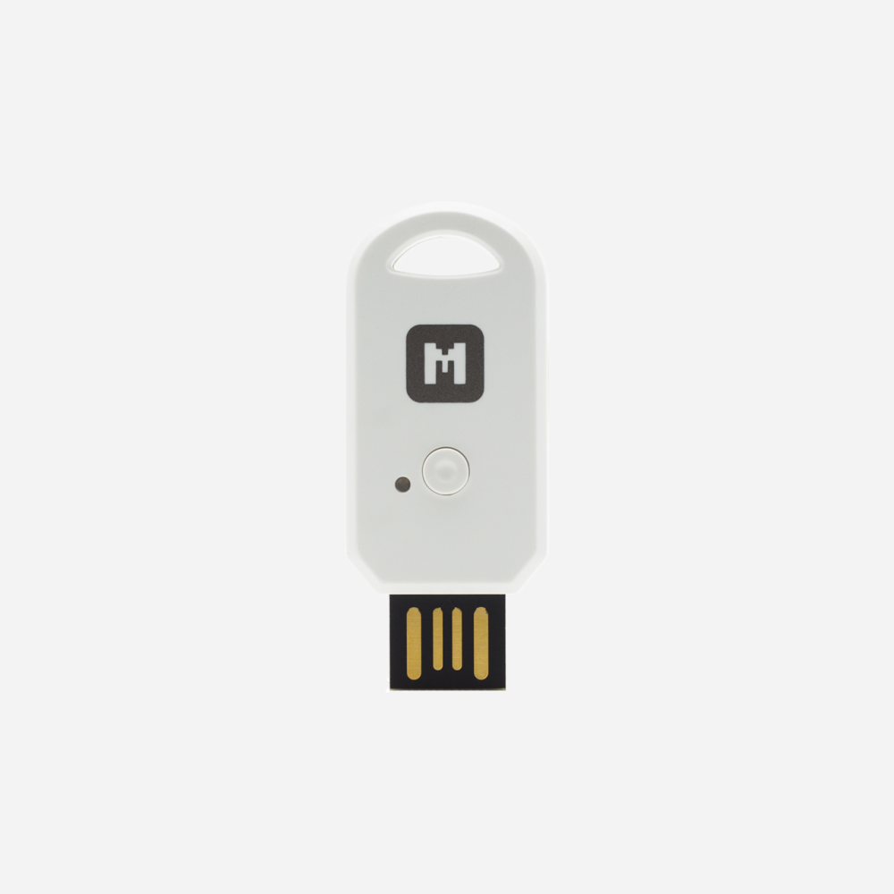][ud52840wcase-product]

    [nRF52840 MDK USB Dongle w/ Case][ud52840wcase-product]

    [Buy now][ud52840wcase-product]{ .md-button .md-button--primary }

    [Documentation][ud52840wcase-docs]{ .md-button }

    [ud52840wcase-product]: https://makerdiary.com/products/nrf52840-mdk-usb-dongle-w-case
    [ud52840wcase-docs]: https://wiki.makerdiary.com/nrf52840-mdk-usb-dongle

-   [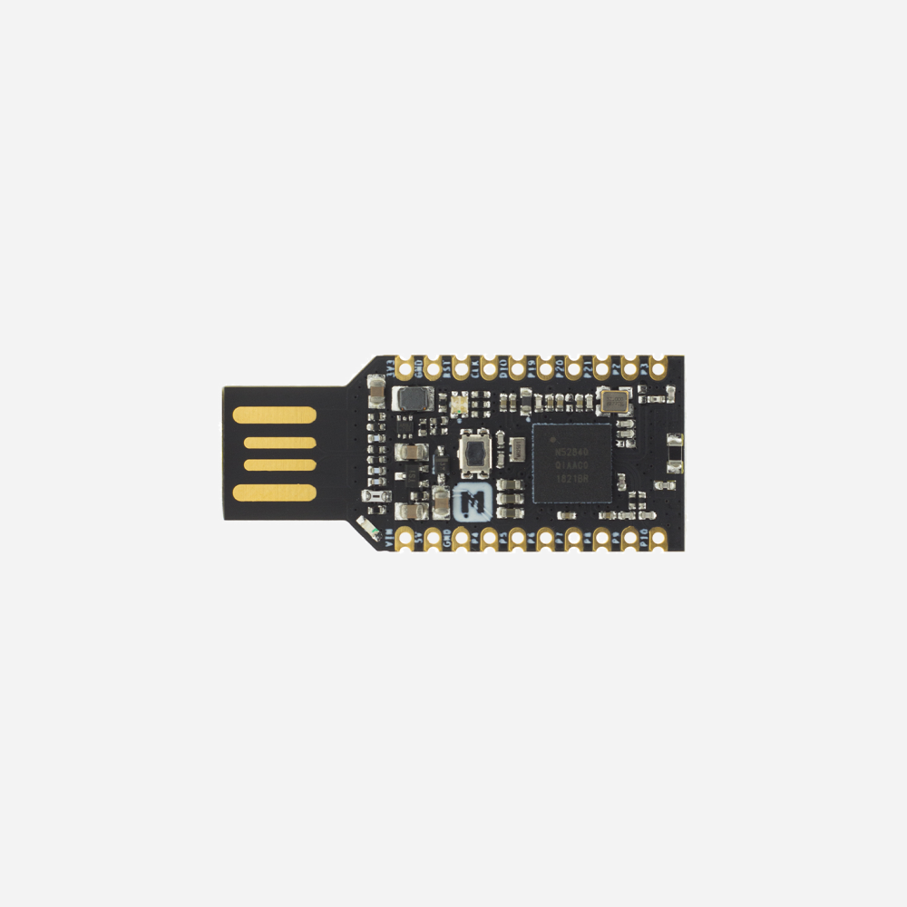][ud52840pcba-product]

    [nRF52840 MDK USB Dongle][ud52840pcba-product]

    [Buy now][ud52840pcba-product]{ .md-button .md-button--primary }

    [Documentation][ud52840pcba-docs]{ .md-button }

    [ud52840pcba-product]: https://makerdiary.com/products/nrf52840-mdk-usb-dongle
    [ud52840pcba-docs]: https://wiki.makerdiary.com/nrf52840-mdk-usb-dongle

-   [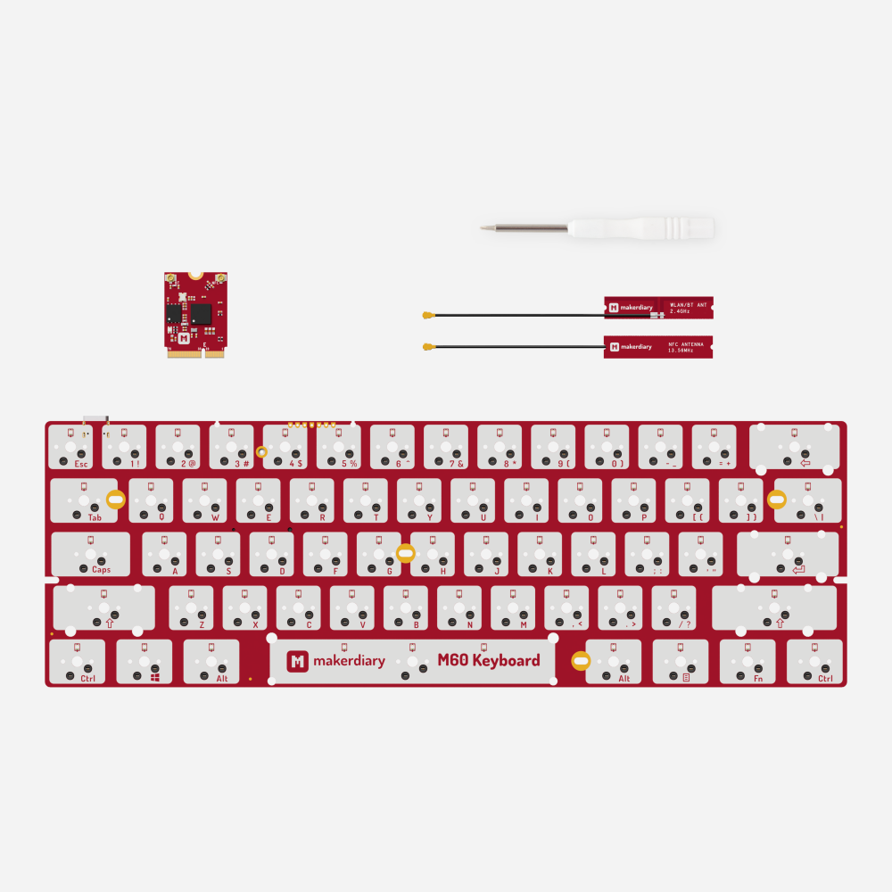][m60pcba-product]

    [M60 Mechanical Keyboard PCBA][m60pcba-product]

    [Buy now][m60pcba-product]{ .md-button .md-button--primary }

    [Documentation][m60pcba-docs]{ .md-button }

    [m60pcba-product]: https://makerdiary.com/products/m60-mechanical-keyboard-pcba
    [m60pcba-docs]: https://wiki.makerdiary.com/m60

-   [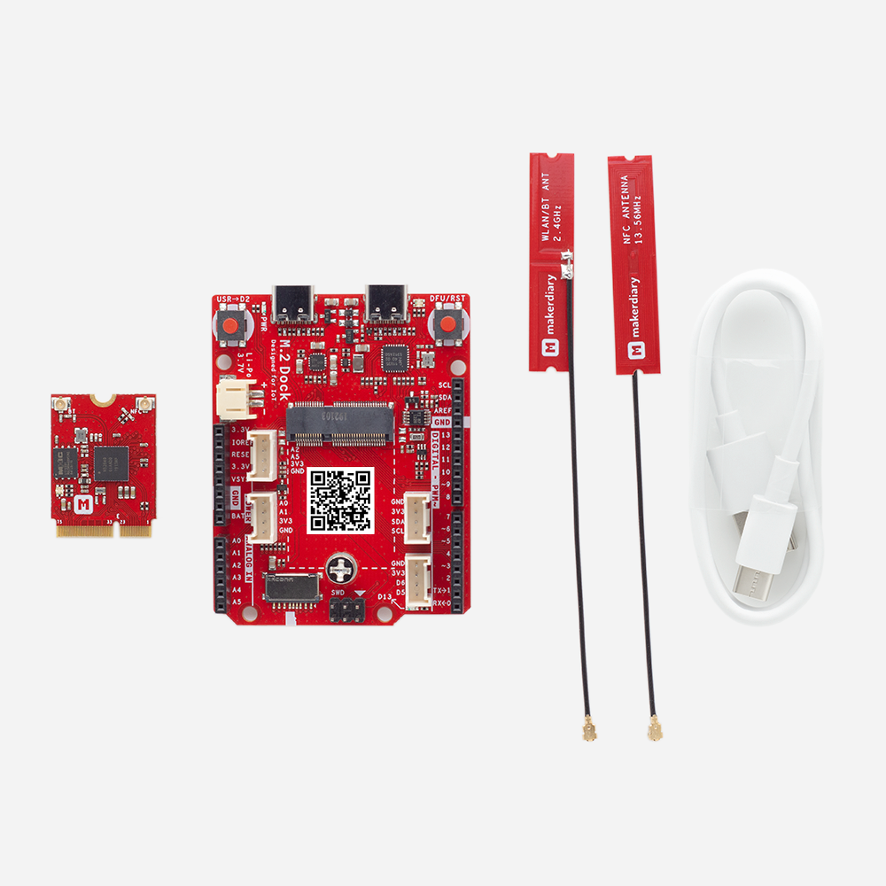][m2devkit-product]

    [nRF52840 M.2 Developer Kit][m2devkit-product]

    [Buy now][m2devkit-product]{ .md-button .md-button--primary }

    [Documentation][m2devkit-docs]{ .md-button }

    [m2devkit-product]: https://makerdiary.com/products/nrf52840-m2-developer-kit
    [m2devkit-docs]: https://wiki.makerdiary.com/nrf52840-m2-devkit

-   [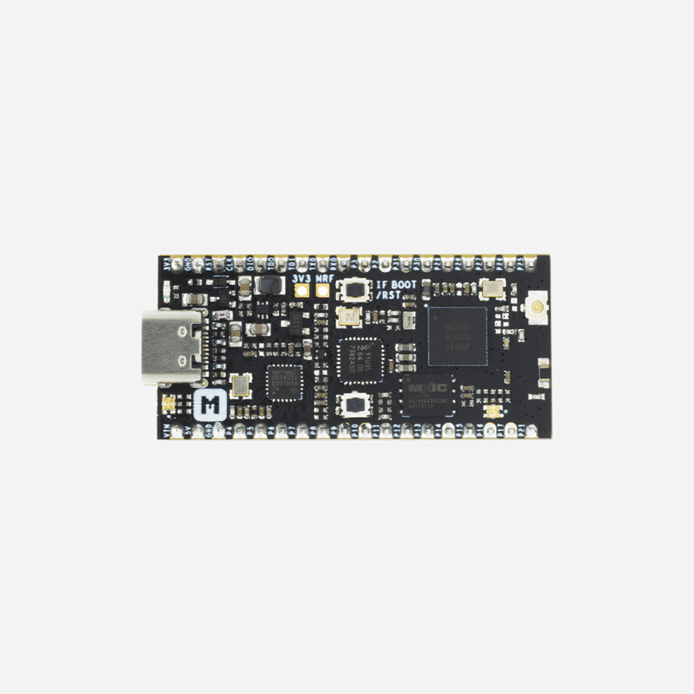][mdk52840-product]

    [nRF52840-MDK IoT Development Kit][mdk52840-product]

    [Buy now][mdk52840-product]{ .md-button .md-button--primary }

    [Documentation][mdk52840-docs]{ .md-button }

    [mdk52840-product]: https://makerdiary.com/products/nrf52840-mdk-iot-development-kit
    [mdk52840-docs]: https://wiki.makerdiary.com/nrf52840-mdk

-   [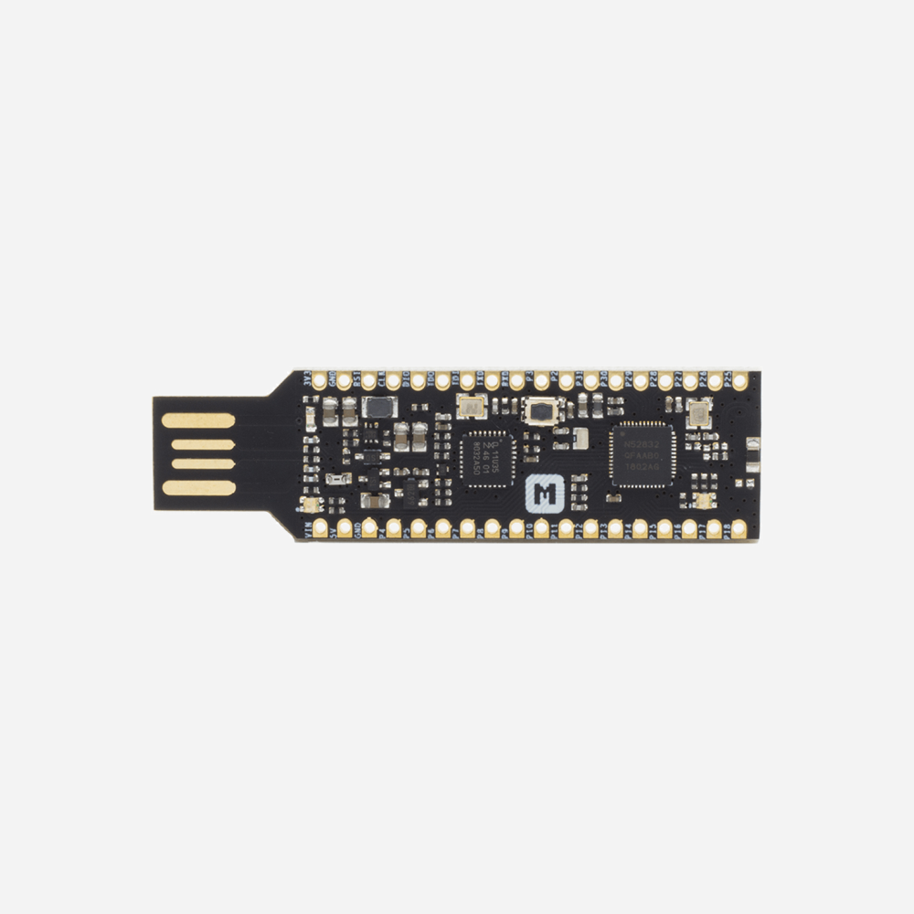][mdk52832v2-product]

    [nRF52832-MDK V2 IoT Development Kit][mdk52832v2-product]

    [Buy now][mdk52832v2-product]{ .md-button .md-button--primary }

    [Documentation][mdk52832v2-docs]{ .md-button }

    [mdk52832v2-product]: https://makerdiary.com/products/nrf52832-mdk-v2-iot-development-kit
    [mdk52832v2-docs]: https://wiki.makerdiary.com/nrf52832-mdk

-   [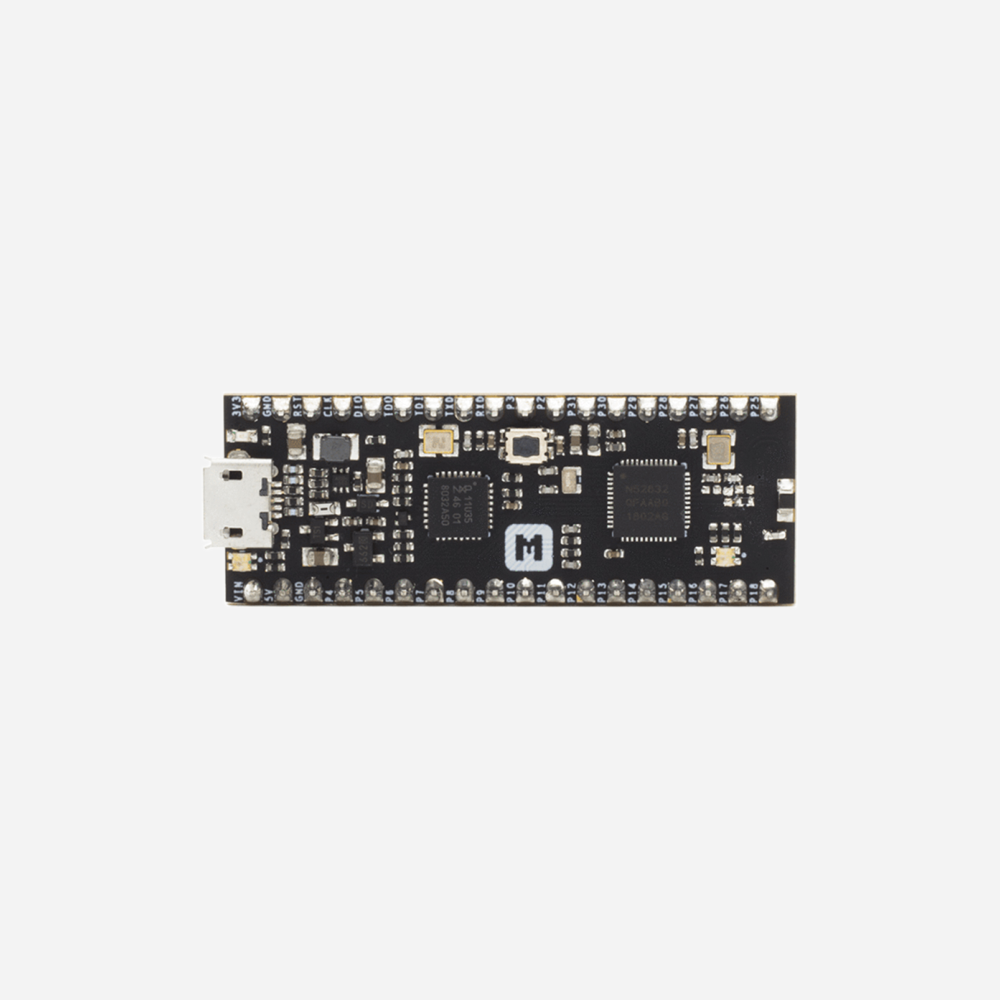][mdk52832-product]

    [nRF52832-MDK IoT Development Kit][mdk52832-product]

    [Buy now][mdk52832-product]{ .md-button .md-button--primary }

    [Documentation][mdk52832-docs]{ .md-button }

    [mdk52832-product]: https://makerdiary.com/products/nrf52832-mdk-iot-micro-development-kit
    [mdk52832-docs]: https://wiki.makerdiary.com/nrf52832-mdk

-   [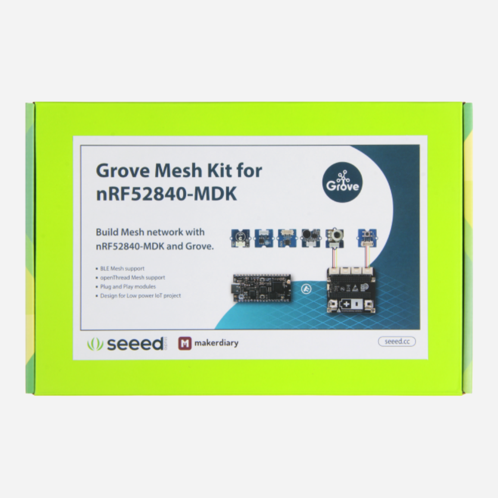][grove-mesh-kit-product]

    [Grove Mesh Kit for nRF52840-MDK][grove-mesh-kit-product]

    [Buy now][grove-mesh-kit-product]{ .md-button .md-button--primary }

    [Documentation][grove-mesh-kit-docs]{ .md-button }

    [grove-mesh-kit-product]: https://www.seeedstudio.com/Grove-Mesh-Kit-for-nRF52840-MDK-p-4053.html
    [grove-mesh-kit-docs]: https://wiki.makerdiary.com/grove-mesh-kit

