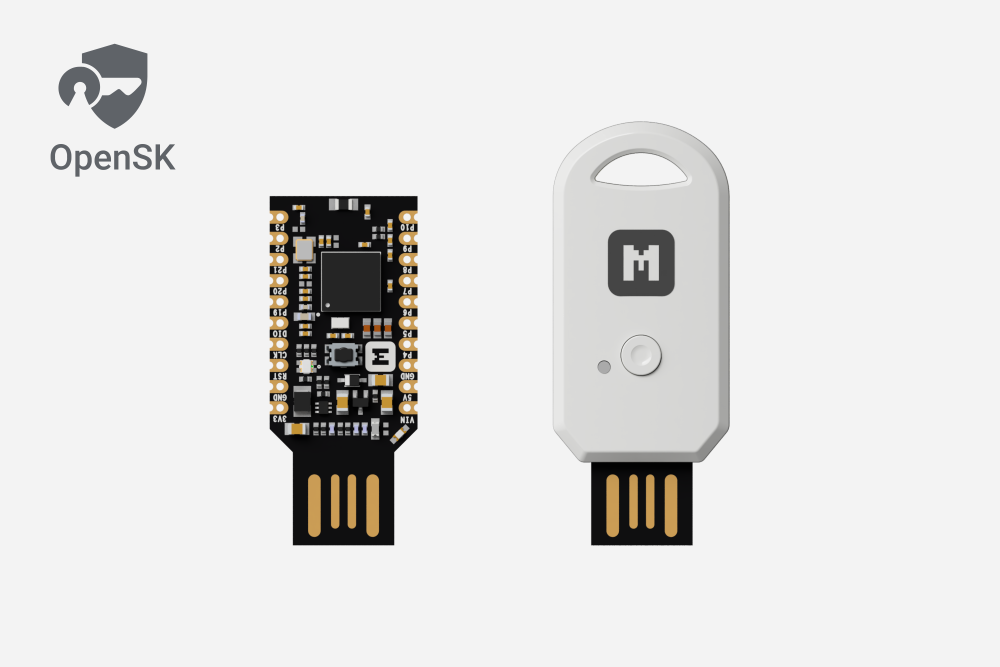
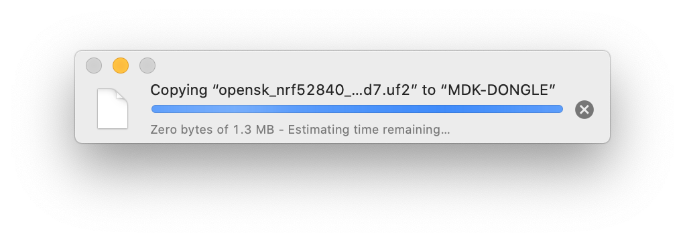
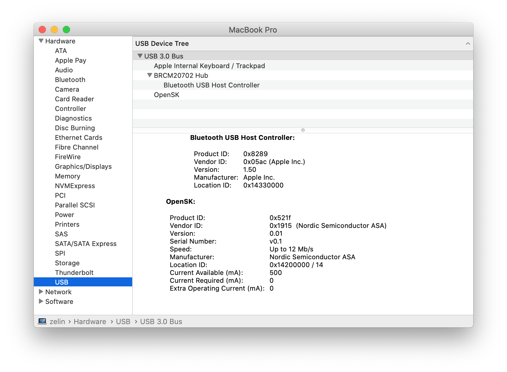

# Getting started with Google OpenSK

<aside class="mdx-author" markdown>
![@makerdiary][@makerdiary avatar]

[makerdiary]

:octicons-calendar-24: February 16, 2020 ·
:octicons-clock-24: 10 min read

</aside>

[makerdiary]: https://makerdiary.com
[@makerdiary avatar]: https://avatars.githubusercontent.com/u/8767354

## Introduction

[OpenSK](https://github.com/google/OpenSK) released by Google is a fully open-source implementation for security keys written in Rust that supports both FIDO U2F and FIDO2 standards.

OpenSK is based on the FIDO2 specifications, which combine the World Wide Web Consortium’s (W3C) [Web Authentication (WebAuthn)](https://fidoalliance.org/fido2/fido2-web-authentication-webauthn/) specification and FIDO Alliance’s corresponding [Client-to-Authenticator Protocol (CTAP)](https://fidoalliance.org/specifications/download/).

The [nRF52840 MDK USB Dongle] works well with OpenSK. Taking advantage of the UF2 Bootloader, you can easily program the OpenSK by just copying the `.uf2`-format image to the flash drive.

This guide details how to get started with the OpenSK using the nRF52840 MDK USB Dongle without going through the complete toolchain installation.

## What you'll need

- An [nRF52840 MDK USB Dongle]
- Latest version of Google Chrome browser (or at least version 38) or Firefox browser

## Flash prebuilt OpenSK via UF2 Bootloader

The prebuilt OpenSK firmware is located in [firmware/OpenSK](https://github.com/makerdiary/nrf52840-mdk-usb-dongle/tree/master/firmware/OpenSK) with the `.uf2`-format.

Enter DFU mode by holding the dongle's __RESET/USR__ button during connecting to your PC. A flash drive with the name __MDK-DONGLE__ will appear.

Copy `opensk_nrf52840_mdk_usb_dongle_gece14d7.uf2` image to __MDK-DONGLE__.

When programming is completed, the OpenSK will run automatically. The device named __OpenSK__ will detected by the computer.

## Test OpenSK

Now you can test the OpenSK via [WebAuthn.io](https://webauthn.io/):

<iframe width="700" height="394" src="https://www.youtube.com/embed/XEmEADLu8yk" title="YouTube video player" frameborder="0" allow="accelerometer; autoplay; clipboard-write; encrypted-media; gyroscope; picture-in-picture; web-share" allowfullscreen></iframe>

## Explore More
The two-factor authentication (2FA) has been successfully deployed by a growing number of websites, including Google, social networks, cloud providers, and many others. Happy trying!

## Reference

- [Google/OpenSK](https://github.com/google/OpenSK)
- [How to build OpenSK with nRF52840 MDK USB Dongle](https://wiki.makerdiary.com/nrf52840-mdk-usb-dongle/opensk/building/)

[nRF52840 MDK USB Dongle]: https://makerdiary.com/products/nrf52840-mdk-usb-dongle
