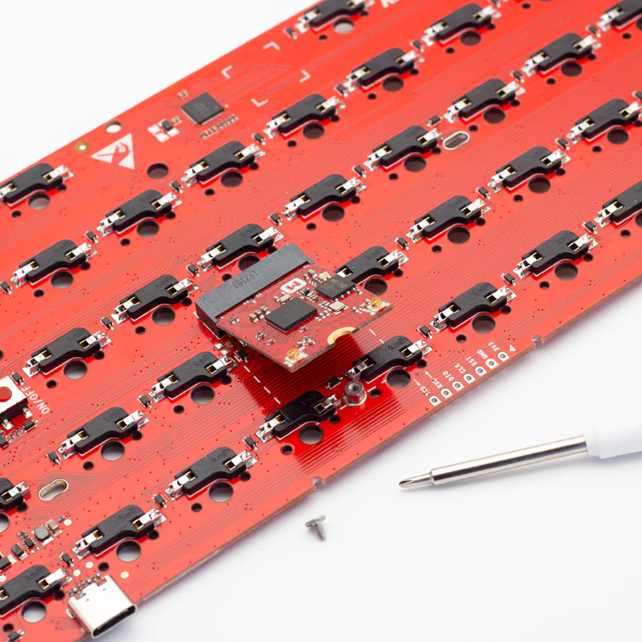

# Meet M60 Mechanical Keyboard

<aside class="mdx-author" markdown>
![@makerdiary][@makerdiary avatar]

[makerdiary]

:octicons-calendar-24: July 13, 2020 ·
:octicons-clock-24: 2 min read

</aside>

[makerdiary]: https://makerdiary.com
[@makerdiary avatar]: https://avatars.githubusercontent.com/u/8767354

A few months ago, we made a hand-wired keyboard powered by Python, which attracted a lot of attention. Lots of people love it, some question it. With putting more time into the Python keyboard, we find it more and more interesting. We think a Python keyboard can make a big difference, so we decided to design a new keyboard for everyone. It's called M60.

Designing a new keyboard is a step by step process. Now, we has finished keyboard PCBA design. We would like to share the process and some ideas behind it with you.

The hand-wired keyboard is a typical prototype. It is a working keyboard and can be used to do some function tests. It has got some feedback. From these feedback, we know that soldering a keyboard is a really hard for most people, so M60 is a solder-free keyboard. It has hot-swapping sockets which makes it super easy to change mechanical switches. You will be able to choose your favorite type of mechanical switches.

With modular design in mind, we designed an M2 module as the core of the keyboard. It is a practice of design for manufacturing, which also improve its repairability.

With Python, the keyboard has very unique features. With no need to download any software or setup a development environment, we can just use a text editor to configure the keyboard or to add a new function. Meanwhile, it also has some disadvantages. Comparing to C, Python is slower, it requires more powerful hardware and has higher power consumption.

Besides, the keyboard is powerful enough to run Python, will also be able to run C/C++, Rust, Go (TinyGo) and JavaScript (JerryScript). The hardware is also optimized for power efficiency.

We always want to get you involved. If you're also interested in the Python keyboard, you can share your idea with us.
