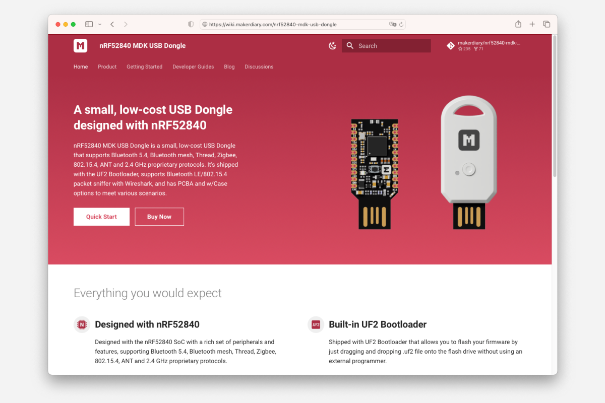

The first commit to the [`makerdiary/nrf52840-mdk-usb-dongle`](https://github.com/makerdiary/nrf52840-mdk-usb-dongle) repository was on Sep 27, 2018. Five years later, nRF52840 MDK USB Dongle has become one of the most popular, open-source nRF52840-based hardware today.

We are excited to announce that Documentation v2.0.0 is now available! There are many updates in this version that we hope you'll like, some of the key highlights include:

- [__Updated Quick Start Guide__](https://wiki.makerdiary.com/nrf52840-mdk-usb-dongle/getting-started/) - Provide a quick introduction to using nRF Connect Bluetooth Low Energy app to demonstrate Bluetooth Low Energy connectivity.
- [__Migrated to nRF Connect SDK__](https://wiki.makerdiary.com/nrf52840-mdk-usb-dongle/guides/ncs/) - nRF Connect SDK is the latest software development kit for building products based on Nordic Semiconductor's chips. We provide an extensive set of documentation and samples to help you getting started.
- [__Added nRF Sniffer for Bluetooth LE__](https://wiki.makerdiary.com/nrf52840-mdk-usb-dongle/guides/ble-sniffer/) - This is a useful tool for debugging and learning about Bluetooth Low Energy applications.
- [__Added nRF Sniffer for 802.15.4__](https://wiki.makerdiary.com/nrf52840-mdk-usb-dongle/guides/nrf802154-sniffer/) - This is a tool for learning about and debugging applications that are using protocols based on IEEE 802.15.4, such as Thread and Zigbee.
- [__Updated OpenSK__](https://wiki.makerdiary.com/nrf52840-mdk-usb-dongle/guides/opensk/) - There are many updates since we landed OpenSK. Now you can try the latest OpenSK firmware, even build your own's.

What's still missing from the updates? Feel free to share your ideas in the [Discussions](https://github.com/makerdiary/nrf52840-mdk-usb-dongle/discussions). Together, we can make this project better!

Last but certainly not least, a big __Thank You__ to the contributors of this project.
