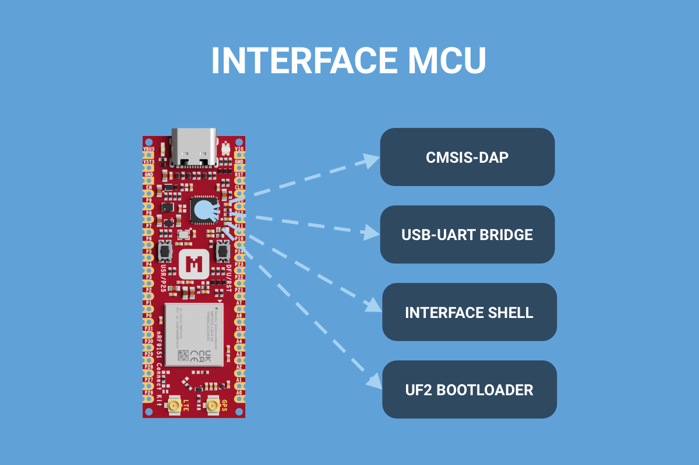

{ loading=lazy }

# Introducing Interface MCU

## Introduction

The nRF9151 Connect Kit comes with an on-board Interface MCU built using the nRF52820. The Interface MCU Firmware is running on the nRF52820. It implements a CMSIS-DAP interface for debugging and programming the nRF9151 SiP. It also exposes two USB CDC ACM devices, one acts as a UART bridge between the host and the nRF9151 SiP, the other enables an Interface Shell for accessing board-specific functionality such as battery charger settings.

The Interface MCU also comes pre-programmed with the UF2 Bootloader, an easy-to-use and self-upgradable bootloader that can be used to update the firmware by just copying the .uf2-format images to the flash drive without using an external programmer.

The following figure describes the functional architecture of the Interface MCU:

## Why Choose the nRF52820

The nRF52820, with its rich feature set and low-power design, is an excellent choice for implementing an Interface MCU.

- __Low Power Consumption__: Ultra-low power is in Nordic's DNA. The nRF52820 draws less than 1 µA in System OFF mode, making it an ideal choice for battery-powered applications.
- __High Performance__: The nRF52820 features a 64 MHz Arm Cortex-M4 processor with 256 KB Flash and 32 KB RAM.
- __Full Speed USB 2.0__: The nRF52820 integrates a USB 2.0 full speed (12 Mbps) controller, which allows the SoC to support multiple functions, such as HID and CDC, simultaneously.
- __Cost-Effective__: The nRF52820 integrates many features into a single chip, reducing the need for additional external components. This integration lowers the overall Bill of Materials (BOM).
- __Comprehensive Development Ecosystem__: Compatible with Nordic’s nRF Connect SDK. This makes it easier to develop and debug applications.

## Getting Started with the Interface MCU

The Interface MCU firmware is open source, and detailed documentation is available to help you get started.

-   [Interface MCU Firmware Source Code]
-   [Interface MCU Firmware Documentation]

[Interface MCU Firmware Source Code]: https://github.com/makerdiary/nrf9151-connectkit/tree/main/applications/ifmcu_firmware
[Interface MCU Firmware Documentation]: https://wiki.makerdiary.com/nrf9151-connectkit/guides/ncs/applications/ifmcu
