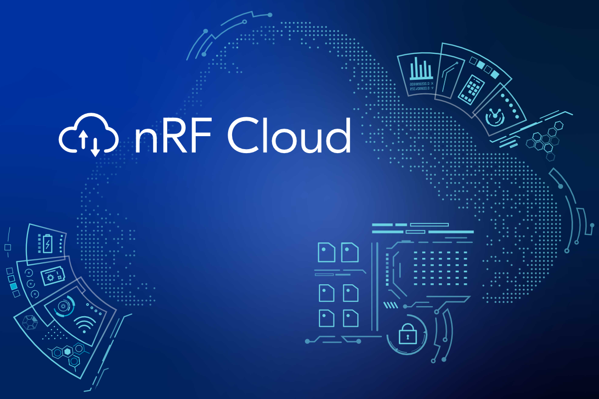

{ loading=lazy }

# Introducing nRF Cloud

## What is nRF Cloud?

nRF Cloud is a comprehensive cloud platform tailored for IoT developers. It bridges the gap between IoT devices and the cloud, offering a suite of services that streamline the entire development lifecycle. Whether you’re building a small-scale prototype or a large-scale deployment, nRF Cloud provides the infrastructure and tools to make your IoT vision a reality.

## Key Features of nRF Cloud

- __Device Management__: Easily onboard, monitor, and manage your IoT devices at scale. Track device health, connectivity status, and performance in real-time.

- __Data Visualization__: Transform raw sensor data into actionable insights with customizable dashboards. Visualize trends, anomalies, and key metrics to make informed decisions.

- __Over-the-Air (OTA) Updates__: Securely deploy firmware updates to devices in the field, ensuring they stay up-to-date with the latest features and security patches.

- __Seamless Integration__: Fully compatible with Nordic’s nRF91 Series and nRF Connect SDK.

- __Security__: Built-in security features, including end-to-end encryption and secure boot, protect your devices and data from threats.

- __Scalability__: Allow you to seamlessly scale from a few devices on a pilot run to thousands of devices on a production deployment.

## Benefits of nRF Cloud

- __Built from the ground-up for low power__: Ultra-low power is in Nordic's DNA. Everything we offer to our customers across hardware, software and cloud services, is optimized for ultra-low power. 

- __Agnostic connectivity transport__: nRF Cloud can be accessed via device-to-cloud or cloud-to-cloud mechanisms, to ensure it fits a variety of use-cases and system architectures.

- __Standalone services and pricing__: Individual selection of services and features allows for a flexible adoption that meets your needs, and pricing plan options that fit the scale of your business.

- __Full lifecycle support__: nRF Cloud services can be leveraged across your product's entire lifecycle, from production to field decommissioning, reducing costs associated with proprietary infrastructure.

## Getting Started with nRF Cloud

We think the best way to learn is by doing. We provides the following samples that help you to get started with nRF Cloud on the nRF9151 Connect Kit.

-   __[nRF Cloud Device Provisioning](https://wiki.makerdiary.com/nrf9151-connectkit/guides/ncs/samples/nrf_provisioning)__
  
    Demonstrate how to use the nRF Cloud device provisioning service.

-   __[nRF Cloud REST Device Message](https://wiki.makerdiary.com/nrf9151-connectkit/guides/ncs/samples/nrf_cloud_rest_device_message)__
  
    Demonstrate how to use the nRF Cloud REST API to send Device Messages.

-   __[nRF Cloud Multi-service](https://wiki.makerdiary.com/nrf9151-connectkit/guides/ncs/samples/nrf_cloud_multi_service)__
  
    Demonstrate how to integrate multiple nRF Cloud services.

