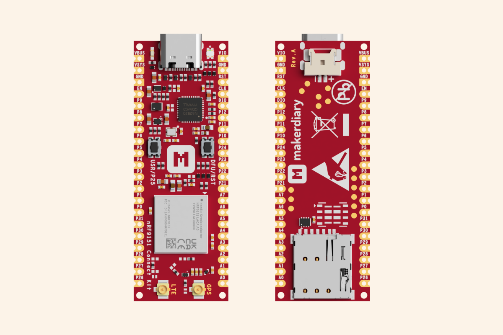

{ loading=lazy }

# nRF9151 Connect Kit is Here!

## Introduction

Today we are excited to launch our latest IoT prototyping kit, the nRF9151 Connect Kit, for LTE-M, NB-IoT, DECT NR+, and GNSS applications. The nRF9151 Connect Kit comes with on-board Interface MCU for debug and programming, flexible power management with battery charger, easy-to-use form factor, nRF Connect SDK support including the Zephyr RTOS, various samples and documentation. It’s designed to help developers quickly prototype and deploy Cellular IoT applications with minimal effort.

## Why Choose the nRF9151 SiP

Like its predecessor, the nRF9161, the nRF9151 supports 3GPP release 14 LTE-M/NB-IoT global coverage and DECT NR+. The nRF9151 stands out from the nRF9160 and nRF9161 with its exclusive features, such as a significant footprint reduction, which allows for more compact products without performance compromises. In addition to Power class 3 (23 dBm), the nRF9151 also supports Power class 5 (20 dBm) output power, leading to 45 percent reduced peak power consumption thanks to the unique nRF9151 low power design, which decreases the cost of battery-powered products. The nRF9151 will also add support for Non-Terrestrial Network (NTN) support in a future firmware release.  

## Key Features of the nRF9151 Connect Kit

- __Global Cellular Connectivity__: Supports LTE-M and NB-IoT networks, ensuring reliable connectivity worldwide.
- __Integrated GNSS__: Built-in Global Navigation Satellite System (GNSS) enables precise location tracking for applications like asset tracking.
- __On-board Interface MCU__: Built-in CMSIS-DAP support for debug, programming as well as modem firmware update, no need for any external tools.
- __Ultra-Low Power Design__: Optimized for battery-powered devices, the kit ensures long operational life, making it ideal for remote and hard-to-reach deployments.
- __Built on Open Source__: Compatible with Nordic’s nRF Connect SDK, including the Zephyr RTOS, various samples, networking protocols, libraries, and hardware drivers, all essential for cellular IoT development.

## Join the Cellular IoT Revolution

The nRF9151 Connect Kit is here to help you unlock the full potential of cellular IoT. With its advanced features and user-friendly design, it’s the perfect platform for developers looking to innovate and lead in the low power Cellular IoT space.

[Get your nRF9151 Connect Kit](https://makerdiary.com/products/nrf9151-connectkit) today and start building the future of connected devices!
