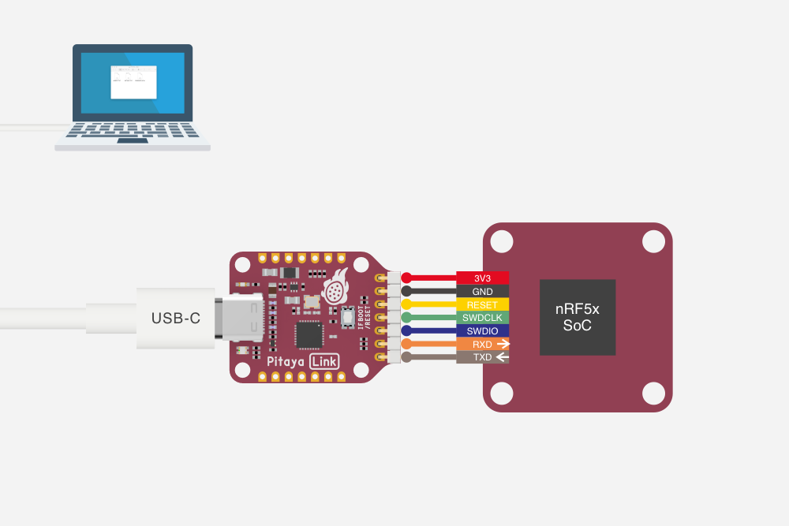
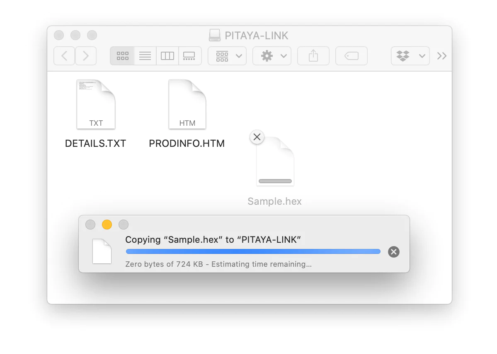

{ loading=lazy }

# Programming nRF5x SoCs with Pitaya-Link

## Introduction

[Pitaya-Link](https://makerdiary.com/products/pitaya-link) is a low-cost debug probe based on the CMSIS-DAP (also known as DAPLink) protocol standard. It can be used to program and debug the application software running on Arm Cortex Microcontrollers.

The design enables developers with Drag-And-Drop programming, Virtual COM Port, CMSIS-DAP compliant debug channel, and access to Arm Cortex Microcontrollers in the browser using WebUSB.

The probe comes with indicator LEDs, a button to reset the target or trigger the firmware update, reversible USB-C connector and easy-to-use 7-pin 2.54mm Header.

This post is intended to assist users in the initial setup and demonstration of programming Nordic's nRF5x SoCs with Pitaya-Link.

## What you'll need

- A [Pitaya-Link Debug Probe](https://makerdiary.com/products/pitaya-link)
- A macOS/Linux/Windows PC
- An nRF52 target board(e.g. [nRF52840 MDK USB Dongle](https://makerdiary.com/products/nrf52840-mdk-usb-dongle))

## Installing pyOCD

pyOCD is an open source Python package for programming and debugging Arm Cortex-M microcontrollers using multiple supported types of USB debug probes. It is fully cross-platform, with support for Linux, macOS, and Windows.

The latest stable version of pyOCD may be installed via pip as follows:

``` bash
python3 -mpip install -U pyocd
```

Alternatively, you can install the latest prerelease version from the HEAD of the `develop` branch, you can do the following:

``` bash
$ python3 -mpip install --pre -U git+https://github.com/pyocd/pyOCD.git@develop
```

Verify if pyOCD works correctly in your terminal:

``` bash
pyocd --version
```

## Connecting the target

Perform the following steps to connect your nRF5x target board:

1. Connect the target board to Pitaya-Link using the provided 7-pin Cable.
2. Connect Pitaya-Link to the PC using the provided USB-C Cable.
3. A disk drive called __PITAYA-LINK__ will be automatically detected by the computer.

{ loading=lazy }

## Programming

Pitaya-Link allows programming of your target MCU in the following two very simple ways:

- Intuitive Drag-And-Drop programming
- Using the `pyocd` executable

### Drag-and-drop programming

Drag-And-Drop is an optional intuitive programming feature. It allows programming of your target MCU by dragging and dropping a file ( `.hex` -format) onto the __PITAYA-LINK__ drive.

There is no need to install application software. Anyone that can drag and drop a file to a USB memory stick can now program the target board.

{ loading=lazy }

### Using the pyocd executable

The `pyocd` command line tool gives you total control over your device with these subcommands:

- `gdbserver`: GDB remote server allows you to debug using gdb via either the console or [several GUI debugger options](https://pyocd.io/docs/gdb_setup).
- `load`: Program files of various formats into flash or RAM.
- `erase`: Erase part or all of an MCU's flash memory.
- `pack`: Manage [CMSIS Device Family Packs](https://open-cmsis-pack.github.io/Open-CMSIS-Pack-Spec/main/html/index.html) that provide additional target device support.
- `commander`: Interactive REPL control and inspection of the MCU.
- `server`: Share a debug probe with a TCP/IP server.
- `reset`: Hardware or software reset of a device.
- `rtt`: Stream Segger RTT IO with any debug probe.
- `list`: Show connected devices.

You can get additional help by adding `--help` option.

To load/erase the nRF52840-based target, open up a terminal and run:

=== "Load `.hex`"

    ``` bash linenums="1"
    pyocd load -t nrf52840 firmware.hex
    ```

=== "Load `.bin`"

    ``` bash linenums="1"
    pyocd load -t nrf52840 --base-address 0x1000 firmware.bin
    ```

=== "Chip Erase"

    ``` bash linenums="1"
    pyocd erase -t nrf52840 --chip
    ```


## Explore Further

Now that you are familiar with the Pitaya-Link, it's time to explore more tutorials available below:

- [Using Pitaya-Link with DAP.js](https://wiki.makerdiary.com/pitaya-link/dapjs/)
- [Using Pitaya-Link with Visual Studio Code](https://wiki.makerdiary.com/pitaya-link/vscode/)
- [Using Pitaya-Link with GNU MCU Eclipse](https://wiki.makerdiary.com/pitaya-link/eclipse/)
- [Using Pitaya-Link with KEIL µVision IDE](https://wiki.makerdiary.com/pitaya-link/keil-mdk/)
- [Using Pitaya-Link with IAR Embedded Workbench](https://wiki.makerdiary.com/pitaya-link/iar-ewarm/)
- [Upgrading the DAPLink Firmware](https://wiki.makerdiary.com/pitaya-link/upgrading/)
- [Building your own DAPLink Firmware](https://wiki.makerdiary.com/pitaya-link/building/)

